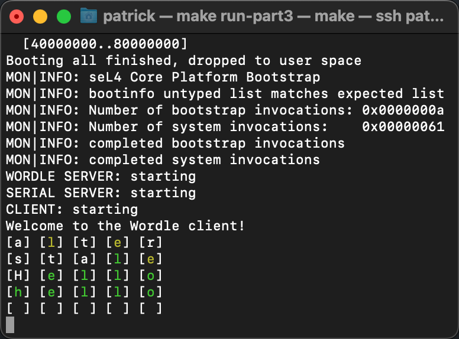

# seL4 Core Platform (seL4cp) Workshop

## Context

* This repo contains my workshop solutions to the [seL4 Core Platform Summit Workshop "Draft-Run"](https://summitdryrun.ivanvelickovic.com/part0.html).
  * The real workshop will be held during the [seL4 Summit 2022 (11-13 Oct)](https://sel4.systems/Foundation/Summit/home.pml) in Munich, Germany.
* The workshop task is a simple C implementation of the popular web-based game, ["Wordle"](https://www.nytimes.com/games/wordle/index.html), running on the [seL4 Core Platform](https://trustworthy.systems/projects/TS/sel4cp/).
* This workshop was my first interaction with the seL4 Core Platform.
  * If you find anything that is incorrect or suboptimal, please let me know by creating a new GitHub Issue on this repo!

## Resources

* [Draft version of the workshop materials.](https://summitdryrun.ivanvelickovic.com/part0.html)
  * My solution is based upon this version of the workshop.
* [Final version of the workshop materials.](https://summit.ivanvelickovic.com/)
  * As of writing (9 Oct 2022), the final workshop materials have not been released.
* [seL4 Core Platform GitHub repo.](https://github.com/BreakawayConsulting/sel4cp)
* [seL4 Core Platform Manual.](https://github.com/BreakawayConsulting/sel4cp/blob/main/docs/README.md)

## Setup

To set up your environment, make sure to follow the workshop instructions [here](https://summitdryrun.ivanvelickovic.com/part0.html).

Once configured, run the following command to verify that your environment has been set up correctly:

```shell
$ make check
```

The resulting output should end with `hello, world` as shown below:

```shell
$ make check

...
Booting all finished, dropped to user space
MON|INFO: seL4 Core Platform Bootstrap
MON|INFO: bootinfo untyped list matches expected list
MON|INFO: Number of bootstrap invocations: 0x00000009
MON|INFO: Number of system invocations:    0x00000022
MON|INFO: completed bootstrap invocations
MON|INFO: completed system invocations
hello, world
```
To exit this QEMU session, press `Ctrl + a` and then the `x` key. You should now be back in your command prompt.

## Running my workshop solution

To run my workshop solution, simply run the following command:

```shell
$ make run-part3
```

The resulting output should look like this:

```shell
$ make run-part3

...
Booting all finished, dropped to user space
MON|INFO: seL4 Core Platform Bootstrap
MON|INFO: bootinfo untyped list matches expected list
MON|INFO: Number of bootstrap invocations: 0x0000000a
MON|INFO: Number of system invocations:    0x00000061
MON|INFO: completed bootstrap invocations
MON|INFO: completed system invocations
WORDLE SERVER: starting
SERIAL SERVER: starting
CLIENT: starting
Welcome to the Wordle client!
[ ] [ ] [ ] [ ] [ ]
[ ] [ ] [ ] [ ] [ ]
[ ] [ ] [ ] [ ] [ ]
[ ] [ ] [ ] [ ] [ ]
[ ] [ ] [ ] [ ] [ ]
```
The aim of the game is to correctly guess the mystery 5-letter word. The game is case-sensitive.

To play the game:
1. Enter a 5-letter word that you think might be the correct word.
   1. If you mistyped, you can press the `BACKSPACE` key.
2. Press the `ENTER` key to submit your attempt.
3. Evaluate the results of your attempt.
   1. A `GREEN` letter indicates the letter **exists** in the word and the letter is in the **correct** position.
   2. A `YELLOW` letter indicates the letter **exists** in the word but is in the **incorrect** position.
   3. A `WHITE` letter indicates the letter **does not exist** in the word.
4. If you didn't guess the correct word, repeat Step 1.

Below is a screenshot of the gameplay:


